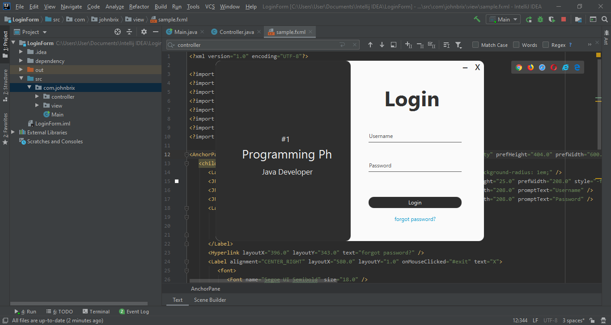

# LoginForm in JavaFX
<h1>I create a login form where we can use our Enter in keyboard to execute our method in Java FX.</h2>

Please read carefully.

<h2>Login Form </h2>

<h3>How to install</h3>

First download the project, Open or import in Intellij IDEA then wait downloading for libraries.

<h3>If you're looking for a dependencies</h3>

You can check at my folder in dependency then you can open those notepad and copy paste in Maven.

• AnimateFX

• Jfoenix

<h3>For the other preferences you may try these </h3>

PS: For the other preferences if you want to Enter without clicking
the username and password textfield, You may pass your parent root in.
controller.keyPressedEnter(root);
 
<h4> Now your method will be like these: </h4> 

public void keyPressedEnter(Parent root){
        
        root.setOnKeyPressed(event -> {
        
            if(event.getCode().equals(KeyCode.ENTER))
            
            {
                //DO YOUR METHOD
                System.out.println("working enter");
            }
            
        });
        
    }
